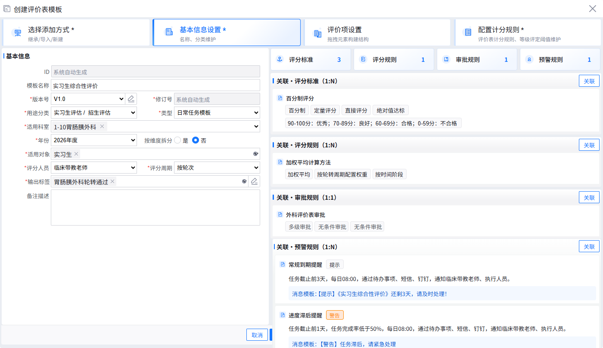
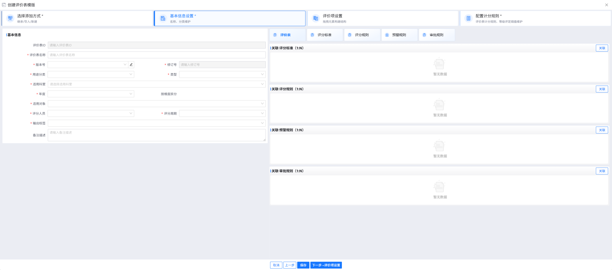
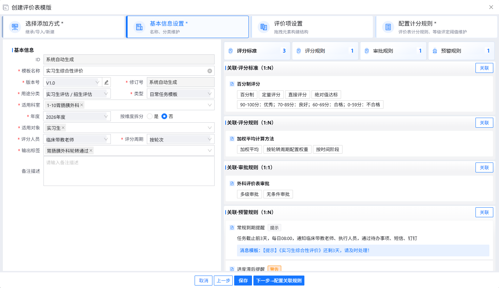
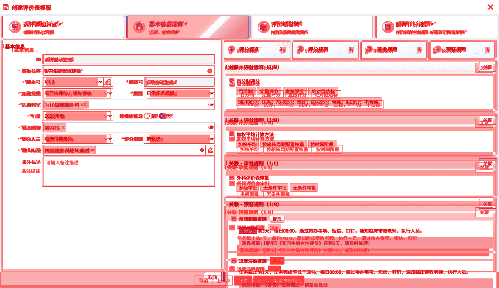
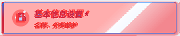
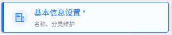
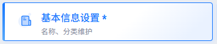
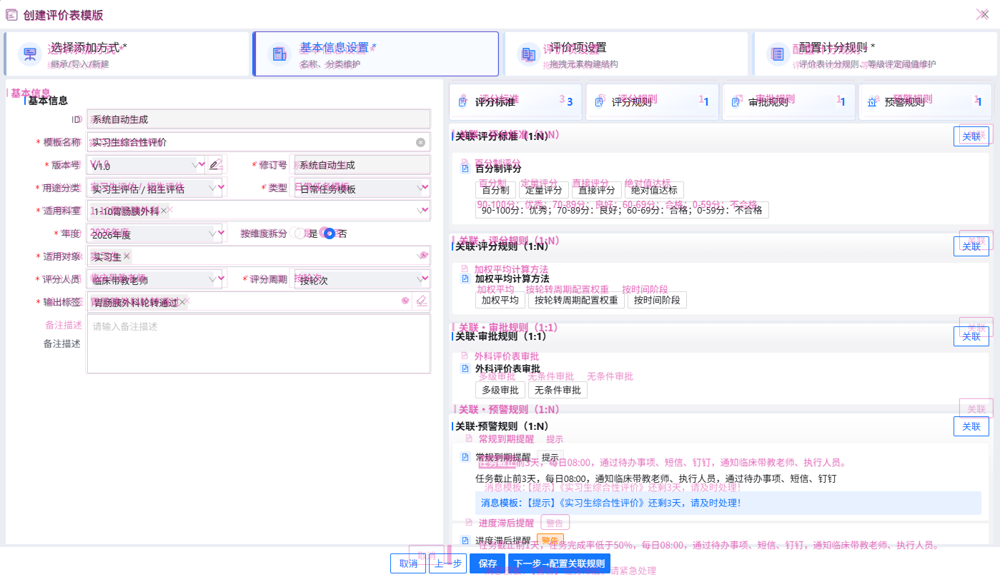

实习期间，前端开发主要围绕设计稿实现页面。功能完成后，间距、字号和颜色等细节仍需多轮调整。该工作流旨在将这部分重复工作交由 AI 辅助完成，涵盖设计稿对照、页面修改与结果验证。

工作流经过近两个月的迭代，核心思路是 **loop engine + 图像 diff**：通过图像对比定位问题，循环修改并验证。图像 diff 包括三个部分：热力图标识颜色差异，叠图呈现位置与形状偏差，差异列表将问题拆分为可逐项处理的局部任务。以下图片展示实际运行结果。

**设计稿**

**修改前的运行页面**

**经过工作流调整后的运行页面**

**最后一轮的热力图**

热力图中仍存在较多差异，部分来自组件库的默认样式，部分来自设计稿本身的不规范之处。子 agent 处理差异列表时，需要结合项目规范判断是否修改，不能仅以消除标红区域为目标。

例如，规范要求左右等分的布局，可能因追求像素对齐而被调整为 47.8% 与 52.2%，沿用设计稿中不规范的比例。同样，为对齐设计稿而修改 Ant Design 5 等组件库的内部样式，可能使页面还原超出原定范围，演变为组件重构。

以“基本信息设置”区域为例，热力图标识了背景和图标附近的差异。结合原图与样式分析，可以确认颜色表现不一致，其中存在 `filter` 缺失。由于相关样式封装在公共组件内部，当前工作流禁止 AI 为消除差异直接修改公共组件，因此将其列为人工确认项。

**局部热力图**

**运行页面**

**设计稿**

此类问题虽不能按当前规则自动修改，热力图仍可缩小排查范围。设计稿中的图标包含更多细节，仅调整颜色和尺寸无法完全对齐。局部截图与分析结果可作为组件维护者的评估依据，用于决定补充 `filter`、调整图标资源或保留现有表现。热力图提供差异位置，具体原因与修改范围仍需结合代码确认。

差异任务通过以下状态区分直接修改、测量验证与人工确认等处理方式：

- `actionable`：问题明确，可以直接修改。
- `measure-before-next-layout-change`：需要先测量，或者等父级布局修复后再检查。
- `depends-on-xxx`：依赖某个组件或上游问题，先解决依赖再处理。
- `confirm-with-user-last`：设计稿不规范、没有更新，或者与公共组件的默认样式冲突，不能擅自修改，留到最后统一确认。
- `complete`：已经完成；即使仍有视觉差异，只要确认符合项目规范，也可以不再修改。

**最后一轮的叠图**

流程的核心是**向 AI 提供明确的问题位置与差异依据**。热力图辅助定位色差，叠图用于判断位置和形状偏差，差异列表负责拆分任务，修改后再次验证。截图、对比和测量等重复操作封装为 CLI 命令，以减少临时脚本编写及中间结果反复输入造成的上下文增长。

当前流程基于静态截图，无法分析动效，对设计稿规范程度要求较高，且 token 消耗较大。每轮均包含图像读取、分析、测量、修改与验证，需要在还原精度和调用成本之间进行权衡。

**相关下载**

[下载热力图对比 JS](./downloads/heatmap.js.txt "download:heatmap.js")
[下载重影对比 JS](./downloads/overlay.js.txt "download:overlay.js")

备注：热力图需要根据截图情况调整差异阈值、色差上限和透明度，默认参数不一定适合所有页面。两个 JS 是独立命令行版本，依赖安装和用法见文件开头及 `--help`。
